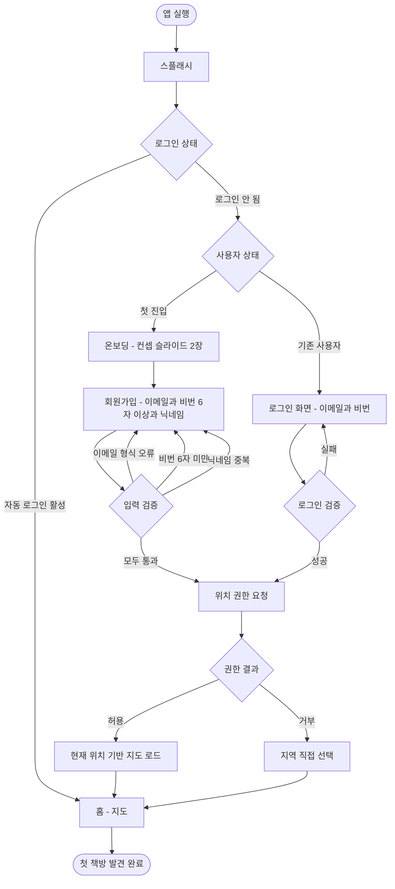
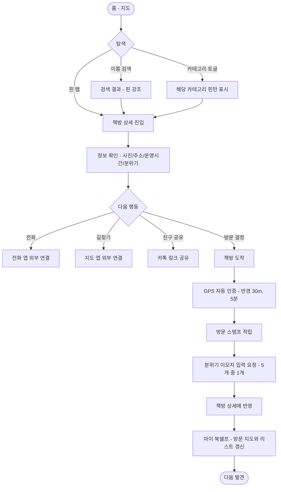

# 숨은 책방 (Hidden Bookstore)
## Phase 1 산출물 — 1차: 사용자 관점

| 항목 | 내용 |
|---|---|
| 문서 종류 | 페르소나 + 사용자 시나리오 + 유저 플로우 |
| 작성일 | 2026-05-07 |
| 버전 | v3.1 (이메일/비밀번호 회원가입 추가) |
| 후속 산출물 | 2차 — 요구사항 분석서 / 기능 명세서 / IA·사이트맵 |
| 비고 | 본 산출물은 대학교 과제 시연용 MVP 범위로 작성됨 |

---

## 0. 서비스 컨셉

> **"동네 책방을 위한 포켓몬 고 — 지도에서 발견하고, 가서 인증하고, 내 동네 책방 지도를 채워가는 앱."**

### 가치 축 2개
1. **발견 (Discovery)** — 지도가 홈, *"동네에 책방이 이렇게 많았다"* 는 인지의 순간을 만든다.
2. **수집 (Collection)** — GPS 방문 인증으로 *"내 동네 책방 지도"* 를 한 칸씩 채워가는 재미.

### 본 서비스가 *하지 않는 것*
- 책 재고 검색·도서 데이터베이스
- 사용자 간 거래·소셜 기능
- 점주 권한 시스템·운영진 어드민 도구
- 결제·예약·카카오톡 채널 연결
- 인스타 자동 수집 같은 외부 API 연동
- SNS 로그인 (카카오·애플 등), 이메일 인증 메일, 비밀번호 찾기
- AI 기능

학교 과제 시연 범위에서 의도적으로 단순화한 결과다. 책의 재고가 궁금한 사용자는 책방 상세 페이지의 *전화번호* 로 직접 연락하는 동선으로 위임한다.

---

## 1. 페르소나

### 이서연 (Local Explorer)

> *"친구들한테 '여기 어때?' 추천받기보다, 내가 먼저 발견해서 알려주고 싶어요."*

| 항목 | 내용 |
|---|---|
| 나이 / 성별 | 26세 / 여성 |
| 직업 | 마케팅 에이전시 주니어 (3년차) |
| 거주지 | 서울 성동구 성수동 (1인 가구) |
| 책 관계 | 월 1~2권 (에세이/소설). 책 자체보다 *"책 있는 공간"* 의 분위기를 즐긴다 |
| 자주 쓰는 앱 | 인스타그램(팔로워 1.2만), 카카오맵, 캐치테이블 |

**Background.**
인스타에 카페·공간 콘텐츠를 올리는 게 취미. 친구·연인과의 만남에서 *"어디 가지?"* 를 항상 자기가 먼저 제안하는 사람. 책방·도서관 특유의 차분한 분위기를 좋아하고, 주말 데이트 코스로 책방을 자주 끼워 넣는다.

**Goals**
- 새로운 분위기 좋은 공간을 발견하고 싶다
- 친구·연인과의 데이트 코스로 책방을 활용하고 싶다
- 방문한 공간을 시각적으로 모으는 재미를 원한다

**Pain Points**
- 매번 가던 곳만 가게 된다 — 새로운 공간 발견이 어렵다
- 동네 작은 책방의 정보가 인터넷에 잘 안 나옴
- 방문 기록이 카톡·앨범·메모에 흩어져 관리가 안 된다

**Tech Savviness.** 상 (SNS 헤비 유저)

### 왜 단일 페르소나인가
초기 검토 과정에서 *북 헌터* (특정 책 찾기 중심)도 동등 1순위로 고려했으나, 해당 시나리오는 책별 재고 데이터에 절대적으로 의존하고, 이를 운영하려면 점주 입력 또는 대형 서점 API 연동이 필요했다. 점주 입력은 동기 부여 문제로, API 연동은 학교 과제 범위를 벗어나는 작업으로 판단되어 *공간 발견* 단일 가치에 집중하는 방향으로 정리됐다.

---

## 2. 사용자 시나리오

### 시나리오 A — 비 오는 일요일, 데이트 코스 발견

비 오는 일요일 오전 11시. 서연은 친구 지원과 오후 2시에 만나기로 했다. *어디 가지?* 고민하다가 어제 가입해둔 *숨은 책방* 앱을 켠다. 자동 로그인되어 바로 지도가 뜬다.

성수동 일대 지도에 핀이 가득. **출퇴근길에 매일 지나치던 골목에도 책방이 두 곳이나 있었다.** 핀 색은 두 가지 — 따뜻한 주황색은 *서점·헌책방*, 차분한 초록색은 *도서관·북카페*. 비 오니까 음료 마시며 머무를 곳이 좋겠다 싶어 상단 카테고리 토글에서 *도서관·북카페* 만 켜자 초록색 핀만 남는다.

한 곳을 탭하니 하단 시트에 미리보기가 뜬다 — *"성수 책방, 도서관·북카페, 0.3km, 최근 사용자가 ☕ 입력"*. [상세 보기] 탭.

상세 페이지에는 사진 3장, 운영시간, 주소, 전화번호, 분위기 태그(최근 다른 사용자가 남긴 ☕ *독서하기 좋은 날*). 마음에 든다. [공유] 버튼으로 친구에게 카톡 링크를 보낸다 — *"여기 어때?"* *"헐 좋아 보임 ㄱㄱ"*.

오후 2시 30분 도착. 앱이 GPS로 자동 인증하면서 알림이 뜬다 — *"방문 인증 완료! 스탬프 적립"*. 그 직후 *"오늘 분위기 어땠어요?"* 5개 이모지(☕ 🌧️ 🎶 🤫 ☀️) 중에서 ☕를 누른다.

마이 북쉘프를 열어보니 방문 지도에 성수동의 한 점이 새로 채워졌다. 이번 달 방문 7곳째.

**핵심 가치 검증**
- 발견 — 매일 지나치던 골목의 책방을 처음 인지
- 수집 — 내 동네 책방 지도가 한 점씩 채워지는 만족감
- 기여 — 분위기 이모지 입력으로 다음 사용자에게 정보가 흐름

### 시나리오 B — 평일 퇴근 후, 산책 모드

평일 저녁 7시 30분. 회사에서 일찍 끝나서 어딘가 들렀다 갈 시간이 생겼다. 성수역에서 내려 앱을 켠다. (자동 로그인되어 바로 지도)

검색바에 *"독립"* 만 입력하니 매칭되는 책방 한 곳의 핀이 강조된다 — 도보 4분 거리.

도착하자 GPS 자동 인증. 한 시간쯤 머물다 나오면서 🤫 *한적한* 이모지를 남긴다. 집 가는 지하철에서 마이 북쉘프를 연다. 방문 지도가 또 한 점 채워졌다.

**핵심 가치 검증**
- 일상의 짧은 시간(10분 만의 발견 → 방문 → 인증)에서도 가치 발휘
- 자동 로그인 덕에 진입 마찰이 거의 없음

---

## 3. 유저 플로우 (Mermaid)

### 3.1 진입 + 인증 (회원가입 / 로그인 / 자동 로그인)

### 3.2 핵심 동선 — 발견 → 방문 → 인증 → 기록

---

## 4. 1차 산출물 요약

| 항목 | 내용 |
|---|---|
| 페르소나 | 이서연 (26세, 마케터) — 단일 |
| 사용자 시나리오 | 주말 데이트 코스 / 평일 산책 모드 — 2종 |
| 유저 플로우 | 진입·인증 + 핵심 동선 — 2종 |
| 가치 축 | 발견 + 수집(방문 지도 채우기) — 2개 |
| 인증 방식 | 이메일 + 비밀번호 + 닉네임 회원가입, 자동 로그인 (SNS 로그인 없음) |
| 핵심 메커닉 | GPS 방문 인증 → 방문 스탬프 + 분위기 이모지 입력 |

다음 단계는 **2차 — 요구사항 분석서 + 기능 명세서 + IA/사이트맵**이다.

---

*문서 끝.*
