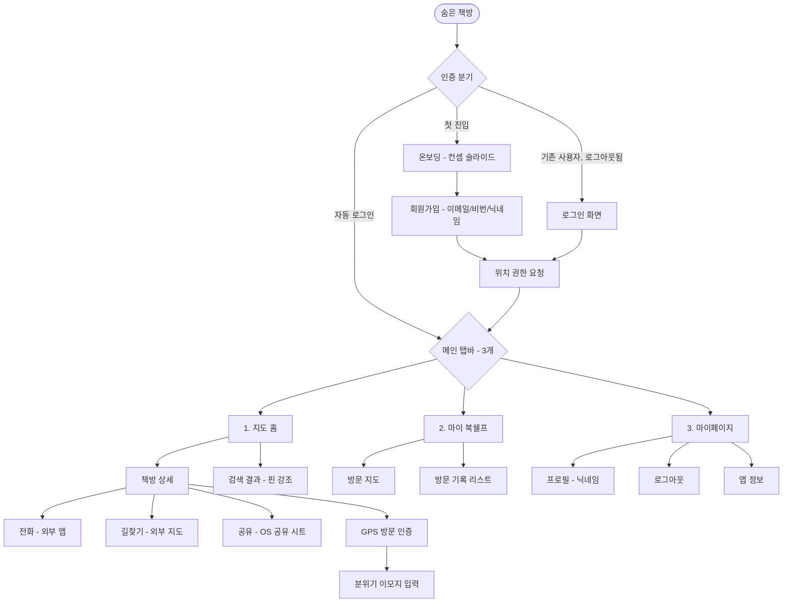

# 숨은 책방 (Hidden Bookstore)
## Phase 1 산출물 — 2차: 제품 정의

| 항목 | 내용 |
|---|---|
| 문서 종류 | 요구사항 분석서 + 기능 명세서 + IA/사이트맵 |
| 작성일 | 2026-05-07 |
| 버전 | v3.1 (이메일/비밀번호 회원가입 + 로그인 화면 추가) |
| 선행 산출물 | 1차 — 페르소나 / 사용자 시나리오 / 유저 플로우 |
| 후속 단계 | Phase 2 — UI 설계 & 와이어프레임 |
| 비고 | 본 산출물은 대학교 과제 시연용 MVP 범위. 운영·확장 요구사항은 의도적으로 범위 외 |

---

# 1. 요구사항 분석

## 1.1 서비스 정의

**숨은 책방** = *"책방을 위한 포켓몬 고"*. 동네의 서점·도서관·북카페를 지도에서 발견하고, GPS로 방문 인증하고, 내 동네 책방 지도를 채워가는 모바일 앱.

**핵심 가치 2개**
1. **발견 (Discovery)** — *"우리 동네에 책방이 이렇게 많았다"* 는 인지의 순간
2. **수집 (Collection)** — 방문 지도가 한 점씩 채워지는 시각적 만족감

**범위 외 (의도된 비-범위)**
- 책 재고 검색·도서 데이터베이스
- 사용자 간 거래·소셜·팔로우
- 점주 권한 시스템·운영진 어드민 도구
- 결제·예약·카카오톡 채널 연결
- 인스타 등 외부 SNS API 자동 동기화
- 카카오·애플 등 SNS 로그인
- 이메일 인증 메일 발송, 비밀번호 찾기·재설정
- AI 기능

## 1.2 책방 데이터 모델

- **카테고리 (2종)**
  - 서점·헌책방 → 주황색 핀
  - 도서관·북카페 (만화 카페 포함) → 초록색 핀
- **분위기 태그 (5종, 사용자 입력)**
  - ☕ 독서하기 좋은 날
  - 🌧️ 비 오는 오후
  - 🎶 음악 흐르는
  - 🤫 한적한
  - ☀️ 햇살 좋은

## 1.3 시연 환경 가정

학교 과제 시연용:
- 시연용 책방 데이터 **15~20곳** (성수동·합정동 등 2~3개 동네 분포)
- 데이터는 코드 내장 또는 로컬 DB로 시드 (실시간 외부 API 연동 없음)
- 시연용 테스트 계정 1~2개 미리 생성 (예: `test@test.com` / `test1234`)
- 다른 사용자의 분위기 태그는 가상 시드 데이터로 일부 표시
- 실제 KPI·사업 목표는 본 과제 범위 외

## 1.4 사용자 요구사항 (페르소나 기반)

이서연 (단일 페르소나) 기준:

- **UR-01.** 첫 진입 시 이메일·비밀번호·닉네임으로 가입할 수 있어야 한다
- **UR-02.** 본인 닉네임이 다른 사용자와 겹치지 않아야 한다
- **UR-03.** 한 번 가입하면 다음 진입부터는 자동 로그인되어야 한다
- **UR-04.** 앱 첫 진입 시 *"동네에 책방이 이렇게 많다"* 는 인지가 즉시 일어나야 한다
- **UR-05.** 핀 색상으로 *"사러 가는 곳"* vs *"머무르는 곳"* 이 구분되어야 한다
- **UR-06.** 카테고리 토글 또는 책방 이름 검색으로 원하는 책방을 빠르게 찾을 수 있어야 한다
- **UR-07.** 책방의 사진·운영시간·연락처를 한 화면에서 확인할 수 있어야 한다
- **UR-08.** 책방에 도착하면 별도 액션 없이 방문이 자동 인증되어야 한다
- **UR-09.** 본인의 방문 기록이 시각적 *"내 동네 책방 지도"* 형태로 누적되어야 한다
- **UR-10.** 친구에게 책방 정보를 외부 메신저로 공유할 수 있어야 한다
- **UR-11.** 방문 경험(분위기)을 가볍게 기록하고 다음 사용자에게 흐를 수 있어야 한다

## 1.5 비기능적 요구사항 (시연 범위)

- 모바일 화면 비율(예: 375x812)에서 작동
- 위치 권한 요청 후 GPS 사용 (없으면 지역 직접 선택으로 폴백)
- 비밀번호는 평문 저장 금지 (해시 처리)
- 시연자 위치는 Mock GPS 또는 실제 GPS 모두 지원
- 인터넷 미연결 환경에서도 시드 데이터로 기본 작동 가능

(실서비스 수준의 보안·확장성·법규 요구는 명시적 범위 외)

## 1.6 제약 / 가정

**가정**
- 시연자의 모바일 디바이스는 GPS·위치 권한 사용 가능
- 책방 정보는 시드 데이터(코드 내장 또는 로컬 DB)
- 사진은 시연용 샘플 (실제 책방 사진 무단 사용 금지)
- 회원 정보는 로컬 DB 또는 간단한 백엔드(예: Firebase Auth)에 저장

**제약**
- 실제 책방 정보 정확성은 시연용 가짜 데이터로 검증 (실운영 데이터 아님)
- 본 과제는 기획·UI 설계까지 수행하며, 실제 백엔드·배포는 범위 외

---

# 2. 기능 명세

## 2.1 기능 매트릭스 (총 7개, 모두 P0)

| ID | 카테고리 | 기능명 |
|---|---|---|
| F-01 | 계정 | 회원가입 + 로그인 (이메일/비번/닉네임) |
| F-02 | 온보딩 | 컨셉 소개 + 위치 권한 요청 |
| F-03 | 탐색 | 지도 홈 (2색 핀 + 카테고리 토글 + 이름 검색) |
| F-04 | 상세 | 책방 상세 페이지 |
| F-05 | 인증 | GPS 방문 인증 |
| F-06 | 기여 | 분위기 이모지 입력 (방문 후) |
| F-07 | 수집 | 마이 북쉘프 (방문 지도 + 방문 리스트) |

P1·P2 단계 별도 분리 없음 — 시연 MVP는 위 7개가 전부.

## 2.2 기능별 상세

### F-01. 회원가입 + 로그인
- **목적**: 사용자 식별 (방문 기록 누적 + 분위기 태그 작성자 구분 + 닉네임 고유성 보장)
- **상세**
  - **회원가입**: 신규 사용자 — 이메일, 비밀번호(6자 이상), 닉네임 입력 → 입력 검증 → 등록
    - 이메일 형식 검증 (실시간)
    - 비밀번호 6자 이상 (실시간)
    - 닉네임 중복 검증 (실시간) — 2~12자 한글/영문/숫자, 공백·특수문자 불가
  - **로그인**: 기존 사용자 — 이메일 + 비밀번호 입력 → 인증
  - **자동 로그인**: 기본 활성화. 한 번 로그인하면 다음 진입부터 로그인 화면 안 거치고 바로 지도
  - **로그아웃**: 마이페이지에서 명시적 로그아웃 가능. 로그아웃 후엔 다음 진입 시 로그인 화면
- **수용 기준**
  - [ ] 회원가입 폼의 모든 필드가 실시간으로 검증되고 오류 메시지가 즉시 표시된다
  - [ ] 로그인 성공 시 다음 진입부터 자동 로그인
  - [ ] 비밀번호는 평문 저장 금지 (해시 처리)
  - [ ] 로그인/회원가입 화면 간 *"계정이 있으신가요? 로그인"* / *"가입하기"* 상호 이동 가능
- **시연 범위 외**: 이메일 인증 메일, 비밀번호 찾기, SNS 로그인

### F-02. 온보딩 + 위치 권한
- **상세**: 첫 진입 시 컨셉 슬라이드 2~3장 → 회원가입(F-01) → 위치 권한 요청 → 지도 진입.
- **수용 기준**
  - [ ] 위치 권한 거부 시 *"권한이 필요합니다"* 안내 + 지역 직접 선택 폴백
  - [ ] 회원가입 ~ 지도 도달까지 1분 이내
  - [ ] 온보딩 슬라이드는 한 번만 노출

### F-03. 지도 홈
- **상세**
  - 현재 위치 중심 지도, 시드 책방 핀 15~20개 표시
  - **2색 핀**: 주황(서점·헌책방) / 초록(도서관·북카페)
  - **방문 완료 핀**: 같은 색이되 채워진 형태 + 작은 골드 배지
  - **카테고리 토글**: 상단에 *"전체 / 서점·헌책방 / 도서관·북카페"* 3개 칩, 하나 선택 가능
  - **이름 검색**: 상단 검색바, 입력하면 매칭 핀 강조 (부분 일치)
  - **핀 탭**: 하단 미리보기 시트 → [상세 보기]로 책방 상세 진입
- **수용 기준**
  - [ ] 지도 로드 후 핀 표시 ≤ 2초
  - [ ] 카테고리 토글·이름 검색 즉시 반영 (≤ 0.5초)
  - [ ] 핀 색 외에 형태로도 카테고리 차별화 (색약 대응)

### F-04. 책방 상세 페이지
- **상세**: 사진 2~3장 슬라이드 → 책방 이름 / 카테고리 / 주소 / 운영시간 / 전화번호 → 분위기 태그 (최근 사용자 입력 1~2개) → 액션 영역 ([전화] [길찾기] [공유]).
- **수용 기준**
  - [ ] 모든 정보를 한 화면 스크롤 내에서 확인 가능
  - [ ] [전화] 탭 → 폰 전화 앱 외부 연결
  - [ ] [길찾기] 탭 → 카카오/네이버 지도 외부 앱 연결
  - [ ] [공유] 탭 → OS 공유 시트 (카톡 등)
  - [ ] 사진 좌우 스와이프 가능

### F-05. GPS 방문 인증
- **상세**: 사용자가 책방 반경 30m 이내 도달 후 5분 체류 시 자동 인증 트리거. 인증 시 토스트 알림 + 방문 스탬프 적립 + 분위기 이모지 입력 요청.
- 시연 환경에서는 Mock GPS도 허용 (실제 책방 방문 없이 시연 가능)
- **수용 기준**
  - [ ] 도착 후 5분 이내 자동 인증 알림 표시
  - [ ] 동일 책방 24시간 내 중복 인증은 1회로 처리
  - [ ] 앱 활성 상태에서만 위치 검증 (백그라운드 추적 없음)

### F-06. 분위기 이모지 입력
- **상세**: GPS 인증 직후 알림으로 5개 이모지 표시 → 1개 선택. 책방 상세에 *"최근 사용자가 ☕ 입력"* 식으로 가볍게 노출. 입력 건너뛰기 가능.
- **수용 기준**
  - [ ] 인증 알림에서 1탭으로 입력 가능
  - [ ] 선택 → 책방 상세 페이지 반영 ≤ 3초
  - [ ] 입력 건너뛰기 옵션 명확히 노출

### F-07. 마이 북쉘프
- **상세**: 별도 탭. 본인이 방문한 책방이 지도에 컬러 핀(미방문은 회색)으로 표시, 하단에 방문 기록 리스트(책방명 + 방문 일자).
- **수용 기준**
  - [ ] 방문 인증 즉시 마이 북쉘프 반영
  - [ ] 상단에 누적 방문 수 표시
  - [ ] 리스트에서 책방 탭 시 책방 상세 페이지로 이동

---

# 3. IA / 사이트맵

## 3.1 정보 구조



## 3.2 화면 구성

**인증 화면 (앱 진입 시)**
```
회원가입 (첫 진입)              로그인 (기존, 로그아웃 상태)
├─ 이메일 입력 (형식 검증)        ├─ 이메일 입력
├─ 비밀번호 입력 (6자 이상)        ├─ 비밀번호 입력
├─ 닉네임 입력 (중복 검증)        └─ [로그인] 버튼
└─ [가입하기] 버튼                  └─ 하단: "회원가입" 링크
   └─ 하단: "로그인" 링크
```

**탭 1. 지도 홈**
```
지도 홈
├─ 상단
│  ├─ 검색바 (책방 이름)
│  └─ 카테고리 칩 (전체 / 서점·헌책방 / 도서관·북카페)
├─ 본문: 지도 + 책방 핀 (2색)
└─ 핀 탭 → 하단 미리보기 시트
   ├─ 책방 이름 / 카테고리 / 거리
   ├─ 사진 1장 + 최근 분위기 이모지
   └─ [상세 보기]
```

**책방 상세**
```
책방 상세
├─ 사진 슬라이드 (2~3장)
├─ 기본 정보 (이름/카테고리/주소/운영시간/전화)
├─ 분위기 태그 (최근 사용자 입력 1~2개)
└─ 액션: [전화] [길찾기] [공유]
```

**탭 2. 마이 북쉘프**
```
마이 북쉘프
├─ 상단: 누적 방문 수 / 이번 달 방문 수
├─ 방문 지도 (방문 책방 = 컬러 핀, 미방문 = 회색)
└─ 방문 기록 리스트 (책방명 + 방문 일자, 최신순)
```

**탭 3. 마이페이지**
```
마이페이지
├─ 프로필 (닉네임 + 이메일 + 누적 방문 수)
├─ 알림 설정 (선택)
├─ 앱 정보 / 학교 과제용 메모
└─ 로그아웃
```

## 3.3 주요 모달 / 시트

| 모달/시트 | 진입 트리거 | 내용 |
|---|---|---|
| 닉네임 중복 안내 | 닉네임 입력 후 중복 검증 실패 | *"이미 사용 중인 닉네임입니다"* + 다시 입력 |
| 로그인 실패 안내 | 잘못된 이메일/비번 입력 시 | *"이메일 또는 비밀번호가 일치하지 않습니다"* |
| 핀 미리보기 시트 | 지도 핀 탭 | 책방 이름 / 사진 1장 / 분위기 / [상세 보기] |
| GPS 인증 토스트 | 책방 반경 30m + 5분 | *"방문 인증 완료"* + 스탬프 적립 |
| 분위기 이모지 입력 알림 | GPS 인증 직후 | 5개 이모지 → 1개 선택 (건너뛰기 가능) |
| 외부 앱 연결 | 전화/길찾기/공유 버튼 탭 | OS 표준 인텐트로 외부 앱 열기 |
| 로그아웃 확인 | 마이페이지의 [로그아웃] 탭 | *"로그아웃하시겠습니까?"* + 확인/취소 |

---

# 4. 향후 확장 방향 (참고, 학교 과제 범위 외)

실제 출시 시 고려할 만한 방향:

- 이메일 인증 메일 / 비밀번호 찾기 / 카카오·애플 SNS 로그인
- 운영진 어드민 도구 (책방 등록·수정·사진 관리)
- 인스타 자동 수집으로 책방 사진 풍부화
- 사용자 후기·평점 시스템
- 책방 즐겨찾기 + 친구와 리스트 공유
- 미방문 인근 책방 추천 알림
- 도서관 OpenAPI 연동 (책 검색 기능 부활)
- 책방 고유 일러스트 프레임 + 인증샷 공유
- KPI 측정 / 운영 어드민 / 보안·법규 요구사항 정비

---

## 5. Phase 1 마무리

| 산출물 | 1차 / 2차 | 상태 |
|---|---|---|
| 페르소나 (단일) | 1차 | ✅ |
| 사용자 시나리오 (2종) | 1차 | ✅ |
| 유저 플로우 (진입·인증 + 핵심 동선, 2종) | 1차 | ✅ |
| 요구사항 분석 | 2차 | ✅ |
| 기능 명세 (7개) | 2차 | ✅ |
| IA / 사이트맵 (3탭 + 인증 화면) | 2차 | ✅ |

다음 단계 — **Phase 2: UI 설계 & 와이어프레임**. 본 IA를 토대로 핵심 화면(온보딩/회원가입/로그인/지도 홈/책방 상세/마이 북쉘프/마이페이지)의 와이어프레임을 작성한다.

---

*문서 끝. 본 2차 문서까지로 Phase 1을 마칩니다.*
